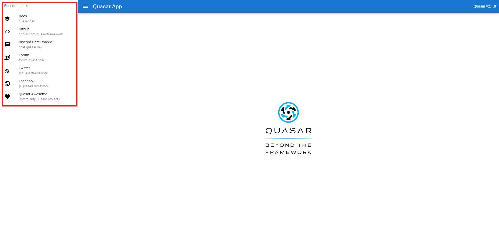

# quasar를 생성하고 생성된 코드 분석

(이런거인거 같다 라고 정리하는 거라 정확하지 않을 수 있음.)

(작성중)


## App.vue

```vue
<template>
  <router-view />
</template>
<script>
import { defineComponent } from 'vue';

export default defineComponent({
  name: 'App'
})
</script>
```

```vue
import { defineComponent } from 'vue';
```

defineComponent는 Vue3에서 사용할 compoistion API이다.


## routes.js

```javascript

const routes = [
  {
    path: '/',
    component: () => import('layouts/MainLayout.vue'),
    children: [
      { path: '', component: () => import('pages/Index.vue') }
    ]
  },

  // Always leave this as last one,
  // but you can also remove it
  {
    path: '/:catchAll(.*)*',
    component: () => import('pages/Error404.vue')
  }
]

export default routes

```

' / '경로는 MainLayout.vue로 이동하고 자식으로 Index.vue를 가진다.

'/:catchAll(.*)'은 404에러발생시 Error404.vue로 이동.


## MainLayout.vue

메인 레이아웃.

시작하면 보이는 화면.

App.vue에서 시작하면 '/ '경로이고, routers.js에서 MainLayout을 import했기 때문에 아래 컴포넌트가 보여짐

q-layout으로 감쌈.

```vue
<template>
  <q-layout view="lHh Lpr lFf">
    <q-header elevated>
      <q-toolbar>
        <q-btn
          flat
          dense
          round
          icon="menu"
          aria-label="Menu"
          @click="toggleLeftDrawer"
        />

        <q-toolbar-title>
          Quasar App
        </q-toolbar-title>

        <div>Quasar v{{ $q.version }}</div>
      </q-toolbar>
    </q-header>

    <q-drawer
      v-model="leftDrawerOpen"
      show-if-above
      bordered
    >
      <q-list>
        <q-item-label
          header
        >
          Essential Links
        </q-item-label>

        <EssentialLink
          v-for="link in essentialLinks"
          :key="link.title"
          v-bind="link"
        />
      </q-list>
    </q-drawer>

    <q-page-container>
      <router-view />
    </q-page-container>
  </q-layout>
</template>

<script>
import EssentialLink from 'components/EssentialLink.vue'

const linksList = [
  {
    title: 'Docs',
    caption: 'quasar.dev',
    icon: 'school',
    link: 'https://quasar.dev'
  },
  {
    title: 'Github',
    caption: 'github.com/quasarframework',
    icon: 'code',
    link: 'https://github.com/quasarframework'
  },
  {
    title: 'Discord Chat Channel',
    caption: 'chat.quasar.dev',
    icon: 'chat',
    link: 'https://chat.quasar.dev'
  },
  {
    title: 'Forum',
    caption: 'forum.quasar.dev',
    icon: 'record_voice_over',
    link: 'https://forum.quasar.dev'
  },
  {
    title: 'Twitter',
    caption: '@quasarframework',
    icon: 'rss_feed',
    link: 'https://twitter.quasar.dev'
  },
  {
    title: 'Facebook',
    caption: '@QuasarFramework',
    icon: 'public',
    link: 'https://facebook.quasar.dev'
  },
  {
    title: 'Quasar Awesome',
    caption: 'Community Quasar projects',
    icon: 'favorite',
    link: 'https://awesome.quasar.dev'
  }
];

import { defineComponent, ref } from 'vue'

export default defineComponent({
  name: 'MainLayout',

  components: {
    EssentialLink
  },

  setup () {
    const leftDrawerOpen = ref(false)

    return {
      essentialLinks: linksList,
      leftDrawerOpen,
      toggleLeftDrawer () {
        leftDrawerOpen.value = !leftDrawerOpen.value
      }
    }
  }
})
</script>

```


### header

```vue
<q-header elevated>
    <q-toolbar>
        <q-btn
               flat
               dense
               round
               icon="menu"
               aria-label="Menu"
               @click="toggleLeftDrawer"
               />

        <q-toolbar-title>
            Quasar App
        </q-toolbar-title>

        <div>Quasar v{{ $q.version }}</div>
    </q-toolbar>
</q-header>
...
<script>
export default defineComponent({
  name: 'MainLayout',

  components: {
    EssentialLink
  },

  setup () {
    const leftDrawerOpen = ref(false)

    return {
      essentialLinks: linksList,
      leftDrawerOpen,
      toggleLeftDrawer () {
        leftDrawerOpen.value = !leftDrawerOpen.value
      }
    }
  }
})
</script>
```


* btn을 클릭하면 toggleLeftDrawer메소드 동작.
* setup()에서 leftDrawerOpen을 false로 선언
* leftDrawerOpen값을 변경함.
* toolbar title과 version정보를 출력

### drawer

QDrawer는 QLayout의 사이드바 부분입니다

```vue
<q-drawer
  v-model="leftDrawerOpen"
  show-if-above
  bordered
>
  <q-list>
    <q-item-label header>
	  Essential Links
    </q-item-label>

    <EssentialLink
      v-for="link in essentialLinks"
	  :key="link.title"
	  v-bind="link"
    />
  </q-list>
</q-drawer>
...
<script>
import EssentialLink from 'components/EssentialLink.vue'

const linksList = [
  {
    title: 'Docs',
    caption: 'quasar.dev',
    icon: 'school',
    link: 'https://quasar.dev'
  },
  {
    title: 'Github',
    caption: 'github.com/quasarframework',
    icon: 'code',
    link: 'https://github.com/quasarframework'
  },
 ...
];

</script>
```

**v-model="leftDrawerOpen"** : header부분에서 클릭 시 toggleLeftDrawer()가 동작하는데, 그때 변경되는 leftDrawerOpen값에 따라 메뉴가 나타나거나 사라짐.

**show-if-above : boolean값, active**<br/>레이아웃 너비가 v-model에 관계없이 중단점보다 크면 초기 렌더링 시 화면에 서랍을 강제로 표시합니다.<br/> 이것은 초기 렌더링 시 클라이언트가 SSR을 인수할 때의 기본 동작입니다.

**bordered** : 구성요소에 기본 테두리를 적용.

**q-list**

script부분에서 linksList를 만들어, 각 title, caption, icon, link를 가지는 객체들의 배열을 만듬.<br/>key를 link의 title로 EssentialLink컴포넌트로 보낸다.


### page-container

```vue
<q-page-container>
    <router-view />
</q-page-container>
```

아마 여기서 Index.vue가 들어가는 거 같다.

routers.js에서 children으로 Index.vue를 아무 추가경로가 없을 때 임포트 했기 때문(?)


## EssentialLink.vue

```vue
<template>
  <q-item
    clickable
    tag="a"
    target="_blank"
    :href="link"
  >
    <q-item-section
      v-if="icon"
      avatar
    >
      <q-icon :name="icon" />
    </q-item-section>

    <q-item-section>
      <q-item-label>{{ title }}</q-item-label>
      <q-item-label caption>
        {{ caption }}
      </q-item-label>
    </q-item-section>
  </q-item>
</template>

<script>
import { defineComponent } from 'vue'

export default defineComponent({
  name: 'EssentialLink',
  props: {
    title: {
      type: String,
      required: true
    },

    caption: {
      type: String,
      default: ''
    },

    link: {
      type: String,
      default: '#'
    },

    icon: {
      type: String,
      default: ''
    }
  }
})
</script>
```



```javascript
<script>
import { defineComponent } from 'vue'

export default defineComponent({
  name: 'EssentialLink',
  props: {
    title: {
      type: String,
      required: true
    },

    caption: {
      type: String,
      default: ''
    },

    link: {
      type: String,
      default: '#'
    },

    icon: {
      type: String,
      default: ''
    }
  }
})
</script>
```

script에서 먼저 넘어오는 데이터들 값의 type과 기본값을 set함.


```vue
<q-item
    clickable
    tag="a"
    target="_blank"
    :href="link"
  >
    <q-item-section
      v-if="icon"
      avatar
    >
      <q-icon :name="icon" />
    </q-item-section>

    <q-item-section>
      <q-item-label>{{ title }}</q-item-label>
      <q-item-label caption>
        {{ caption }}
      </q-item-label>
    </q-item-section>
  </q-item>
```

link는 넘어온 데이터의 link

**clickable : Boolean값**<br/>QItem을 클릭할 수 있는가? 이 경우 호버 효과가 추가되고 '클릭' 이벤트가 발생합니다.

**tag : String**<br/>렌더링할 HTML 태그 제안<br/>기본 값 : div<br/>예 : div, span, a, label

**q-item-selection : Boolean값**<br/>아바타 아이템 측면 렌더링('사이드' 소품을 설정할 필요 없음)

좌측의 아이콘이 위치하고,  넘어온 title, caption을 보여준다.


## Index.vue

```vue
<template>
  <q-page class="flex flex-center">
    
  </q-page>
</template>

<script>
import { defineComponent } from 'vue';

export default defineComponent({
  name: 'PageIndex'
})
</script>

```

빨간색 부분을 보여줌.

